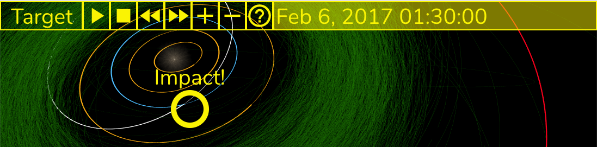

# Explore the Aquarius Asteroid's Orbit and Impact!

A WebGL visualization for the [Adler Planetarium's Aquarius Project](https://www.adlerplanetarium.org/education/far-horizons/the-aquarius-project/).  A live version is available [here](https://ageller.github.io/Adler_AquariusProject/).

## The Aquarius Project Interactive

The [Aquarius Project](https://www.adlerplanetarium.org/education/far-horizons/the-aquarius-project/) is an [Adler Planetarium](https://www.adlerplanetarium.org) program to search for a meteor that impacted in Lake Michigan on Feb. 6, 2017. In this online interactive, you start by viewing the Solar System two and a half years before the Aquarius Project asteroid enters the Earth's atmosphere.  This is nearly one full orbit of the Aquarius Project asteroid. Orbits are color coded : white for the Aquarius project meteor; blue for Earth; yellow for the inner rocky planets (Mercury, Venus and Mars), red for the outer gaseous planets (Jupiter, Saturn, Uranus, and Neptune), purple for Pluto, and green for the asteroid belt. The asteroid is slightly enlarged and also circled in yellow for visibility. 

To zoom in on an individual object, choose your Target from the dropdown menu. This will also lock the camera on the chosen object. You can also manually zoom in and out of the Target object with your mouse wheel (or pinch), as well as control the camera viewing angle by click (or touch) + drag .

## Acknowledgments

This  application was written by [Aaron M. Geller](http://faculty.wcas.northwestern.edu/aaron-geller/index.php) and [Maria A. Weber](https://astro.uchicago.edu/people/maria-weber.php), using the three.js library. Mark Hammergren calculated the asteroid orbital elements. Patrick McPike contributed the asteroid design element. The following are links to locations where we downloaded the various textures for the planets: 
[Mercury](https://astrogeology.usgs.gov/search/map/Mercury/Messenger/Global/Mercury_MESSENGER_MDIS_Basemap_EnhancedColor_Mosaic_Global_665m?p=1&pb=1#downloads), [Venus](https://maps.jpl.nasa.gov/venus.html), [Earth](https://www.solarsystemscope.com/textures/), [Earth clouds](https://github.com/turban/webgl-earth/tree/master/images), [Moon](https://astrogeology.usgs.gov/search/map/Moon/Clementine/UVVIS/Lunar_Clementine_UVVIS_750nm_Global_Mosaic_118m_v2), [Mars](https://maps.jpl.nasa.gov/mars.html), [Jupiter](https://svs.gsfc.nasa.gov/12021), [Saturn](https://www.solarsystemscope.com/textures/), [Saturn rings](https://alpha-element.deviantart.com/art/Stock-Image-Saturn-Rings-393767006), [Uranus](http://planetpixelemporium.com/uranus.html), [Uranus rings](https://jcpag2010.deviantart.com/art/Uranus-Rings-558779857), [Neptune](https://www.solarsystemscope.com/textures/), [Pluto](https://www.nasa.gov/image-feature/pluto-global-color-map).  The Milky Way panorama image is from [ESO](https://www.eso.org/public/usa/images/eso0932a/).

